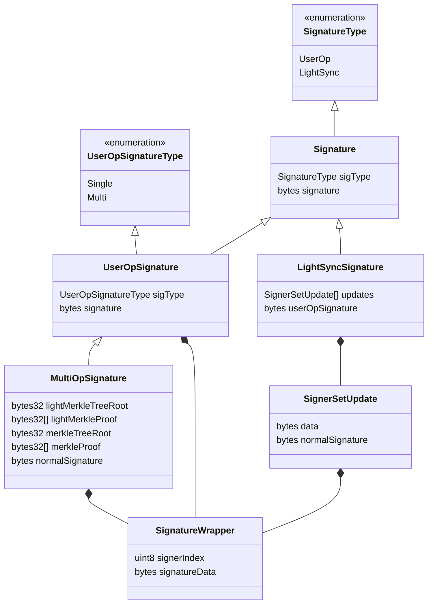

# Smart Vaults

Smart accounts signature scheme for Single/Bundled User Ops and ERC1271 with light state sync.

## Build

`pnpm build`

## Test

`pnpm test`

### Coverage

`pnpm test:coverage`

### Coverage Report

`pnpm test:coverage:report`

## Lint

`pnpm lint`

### Format

`pnpm format`

## Developers/Integrators

### Foundry

`forge install 0xSplits/splits-contracts-monorepo`
