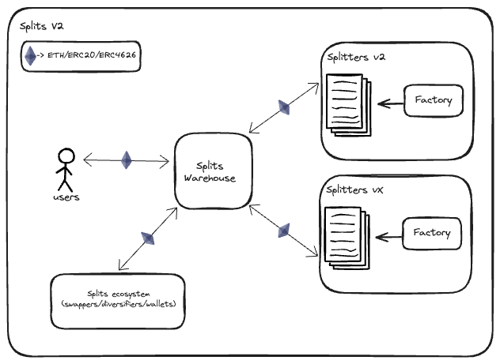

# Splits - v2

## Build

`pnpm build`

## Test

`pnpm test`

### Coverage

`pnpm test:coverage`

### Coverage Report

`pnpm test:coverage:report`

## Lint

`pnpm lint`

### Format

`pnpm format`

## Deployment

To deploy contracts, please ensure you have the environment variables set in `.env` file. Please refer to `.env.sample`
for the required environment variables.

For a chain not present in .env.sample, add the rpc url and etherscan API key to the .env.sample file and
[foundry.toml](./foundry.toml) file.

To understand how the configuration works, please refer to [foundry docs](https://book.getfoundry.sh/cheatcodes/rpc).

Each contract has its own deployment script. A config file is present in the `config` folder for each chain. The config
files contains the input needed for the constructors of the contracts.

The scripts use foundry's wallet to import the private key. To create the wallet refer to [this](https://book.getfoundry.sh/reference/cast/cast-wallet-import).

e.g. `cast wallet import SPLITS_DEPLOYER --interactive`

To deploy contracts and verify contracts, run the following command:

### Splits Warehouse

`pnpm deploy:SplitsWarehouse`

For a test run, use the following command:

`pnpm deploy:SplitsWarehouse:test`

### Split Factory V2

`pnpm deploy:SplitFactoryV2`

For a test run, use the following command:

`pnpm deploy:SplitFactoryV2:test`
